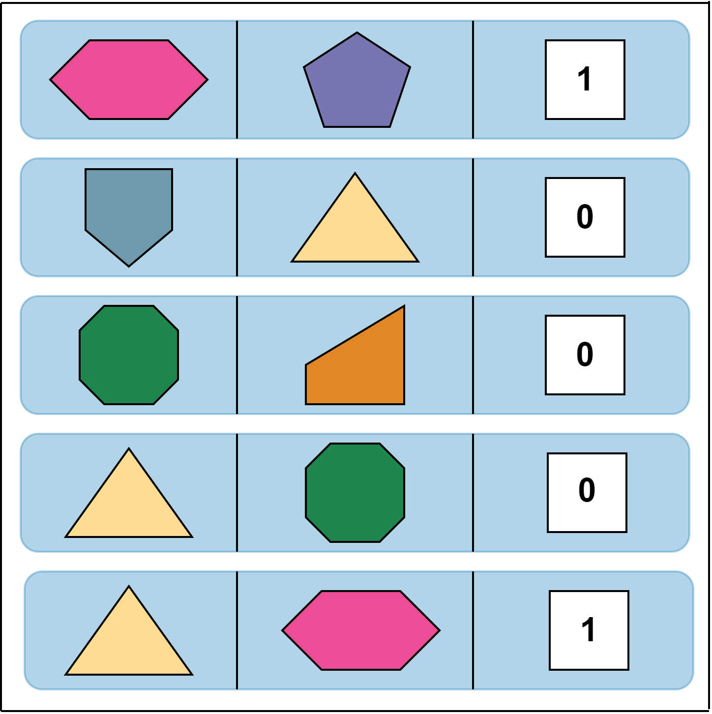
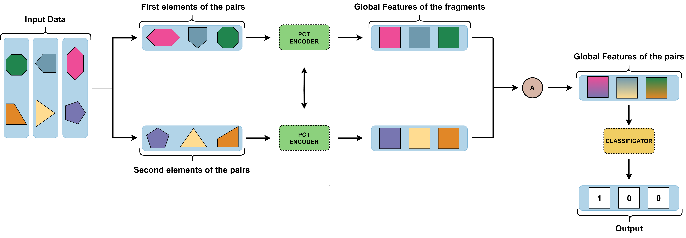
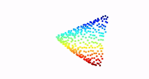

 # Point cloud transformers for 3D fragment matching

  
 Couple 0 of the Test set

This repository refers to my master's thesis in the Data Science graduate program at Sapienza University.

The code used as a reference and starting point of this work for Point Cloud Transformer (PCT) is : [here](https://github.com/qq456cvb/Point-Transformers) (Menghao implementation)

## Abstract
This work extends a previous preliminary investigation done by [Alessandro Baiocchi et al.](https://iopscience.iop.org/article/10.1088/2632-2153/ad035e) on data from the ["Ente Parco Archeologico del Colosseo"](https://colosseo.it),, whose decisive contributions proved to be the creation of a repository of synthetic datasets containing fragments of 3D objects, called Broken3D, and the execution of the task of internal/external fragment classification.
The goal of the thesis reported in this repository is instead to build a model capable of practicing the task of fragment matching. Given two 3D scans of fragments, the model must predict whether they are adjacent or not.
The key contributions of this work can be divided into both practical and
theoretical aspects: From a theoretical perspective, there is a noticeable scarcity of models and papers
focusing on the reconstruction of artifacts. This work represents a novel approach in
this field by employing the Point Cloud Transformer architecture. This contribution
adds a unique theoretical dimension to the existing body of knowledge, introducing
innovative methods for artifact reconstruction. On the practical side, the significance
of this work is evident. The model offers valuable support to archaeologists in the
intricate task of reconstructing fragmented artifacts. By doing so, it opens new
horizons for investigation and enhances our understanding of the past. The practical
contribution underscores the real-world applications and implications of the proposed
model in the field of archaeology.

## Data
The data used in this work is the Rotated cuts dataset (RCD) that comes from the [Broken3D archive](https://deeplearninggate.roma1.infn.it/). In the collection, the dataset was obtained from 3D solid objects which were cut to create fragments. In addition to the classic structure of point clouds, these datasets have four additional features per point: nx, ny, nz, and A. The first three represent the normals regarding x, y, and z, respectively, while the last one is the area of the triangle associated with the individual point. 

The RCD (Randomized Cutting Dataset) was constructed from 2180 solid objects of the types cube, sphere, and torus. The cutting surfaces have random orientations, allowing for fragments with realistic shapes. These surfaces have been designed
to be irregular, adding further realism. Furthermore, a random noise was applied to the vertices of the triangle meshes. This noise was introduced to mimic the effects of aging and accidental breakages that can occur in artifacts. Going into more detail, the dataset is divided into clusters, each having two macro elements [n_clusters, 2]. The first, with the shape [n_f rags, 1024, 7], represents the set of fragments belonging to the i-th cluster. The second macro element is the adjacency matrix associated with the cluster, providing crucial indications on how the pieces should be joined to form the original object. The dataset is divided into three parts: Train set, Validation Set, and Test Set, with proportions of 70%, 15%, and 15% of the total, respectively.
Originally organized in clusters, to be processed by the neural network created in this work all possible pairs are unrolled and saved in a list in triplets [frag_a, frag_b, label].

 

  
    Input data
  

Given the large number of pairs in the dataset (about 2 million), 10,000 balanced pairs are selected at each epoch. In other words, 5000 pairs of adjacent fragments and an equal number of non-adjacent are extracted through random sampling of the dataset. Concerning the validation set and the Test set, a subsample of the original datais also used here. Specifically, three thousand positive pairs and an equal number of negative pairs are randomly included, which, unlike the training set, are kept
constant throughout the training cycle.

* The Train set used is : [here](https://drive.google.com/file/d/1k0u6Ycnizsu2SJv-FDkrXtIK6mOiOoca/view?usp=drive_link)
* The randomized Validation set used is: [here](https://drive.google.com/file/d/1UWc90jlblj_aks512WgtJRRJe9qyxEEO/view?usp=drive_link)
* The randomized Test set used is: [here](https://drive.google.com/file/d/17YF-sJryzKPkg8W-1FRWMt_62Y3cS-1o/view?usp=drive_link)

## Model
The neural network developed for this thesis, as shown in the Figure, presents an architecture having two branches. In each of the two branches, there is the point cloud transformer encoder having shared weights. Compared to the original PCT encoder, modifications were made to allow compatibility with the data sizes used in this work. Each fragment has 7 features instead of the traditional three required by the first layer of the PCT encoder.

The input pairs are divided into two groups, one containing the first elements of each pair and the other the second. To enhance the model’s generalization capability, each individual point cloud undergoes a random rotation, serving as a form of data augmentation. Furthermore, all fragments are translated to the origin. These tensors of fragments are processed in parallel in the two branches of the network through the pct encoder layers. The output of each branch represents the global features of the individual fragments input. The next step is to go and aggregate the two tensors produced to arrive at the global features of the pairs. Named $G_1$ and $G_2$, the global characteristics of the first and second elements of the pair, respectively, are aggregated through the use of two symmetrical functions, sum and multiplication, thus producing the global characteristics of the pairs ($G\_{Tot}$).

*Pair Model*

Then, $G\_{Tot}$ is input to the PCT's original classifier, which consists of three linear layers, where both relu and batch normalization are applied on the first two, interspersed with two dropout layers. 
In the output, the model generates predictions regarding the adjacency of the two elements forming the pair.  

## Results

The following table shows the metrics for the three different runs performed, in the last column the link to download the weights of the trained model can be accessed.
| Number of Features        | Loss          | Accuracy  | F1 Score | AUC Score| Weights|
| ------------- |:-------------:| -----:|-----:|-----:|-----:|
| 3 | 0.628 | 0.650 | 0.649 | 0.698 | [Epoch 63](https://drive.google.com/file/d/1EUoxbtQ0-mnN-WUBiuLykIRP-mGSImaE/view?usp=sharing)|
| 6 | 0.621 | 0.655 | 0.655 | 0.709 | [Epoch 43](https://drive.google.com/file/d/13cdu3c3Adxyo_a0VtKkRIFbCrpav9bH0/view?usp=sharing)|
| 7 | 0.618 | 0.657 | 0.657 | 0.715 | [Epoch 116](https://drive.google.com/file/d/12wQAUwk6HGAq31u1YmNjTJ8JXqxPBJ_R/view?usp=drive_link)|

The results indicate that having more information in the data, as one would logically expect, leads to slightly better metrics. It is important to consider that although there is little difference between
three and seven features when considering only the best epochs, examination of average performance reveals a clear distinction, complying with what is indicated in the scientific literature about the importance of normal features. The difference between having six and seven features is almost negligible, both in best epoch and average performance. Therefore, the seventh feature, can be removed from the original
data, as it does not contribute to increased performance, but rather burdens the data by increasing the memory required by the network.

Another study was conducted to evaluate the effect of data augmentation on the model. The link to download the model weights without data augmentation is: [here (Epoch 98)](https://drive.google.com/file/d/1LikkbhCHqgWpocWq_R6fbTd2YsrnyRwb/view?usp=sharing).  The results of the comparison are shown in the following table:
|Train Data| Test Data | Loss          | Accuracy  | F1 Score | AUC Score|
| ------------- |:-------------:| -----:|-----:|-----:|-----:|
| Original Data | Original Data | 0.613 | 0.660 | 0.659 | 0.72  | 
| Original Data | Augmented Data| 0.625 | 0.648 | 0.644 | 0.707 | 
| Augmented Data| Original Data | 0.618 | 0.657 | 0.657 | 0.715 | 
| Augmented Data| Augmented Data| 0.617 | 0.659 | 0.659 | 0.715 | 

It can be noted that there is an effect, albeit small, on performances: the model trained without data augmentation, when evaluated during inference on the test set where random rotations are applied, seems to have less effective predictions compared to when evaluated on the original data. In the case of the other model, however, the difference between the two inference scenarios appears to be negligible. It exhibits the same performance regardless of the orientation of the point clouds, thus achieving the goal of making it rotationally invariant.

## Considerations on predictions of model pairings
It was decided to investigate more deeply into the predictions made by the network. The objective was to scrutinize the behavior and decisions of the model through a graphical analysis of the two elements that make up the various pairs, to understand if the shapes of the fragments influence predictions. Examining various pairs, one of the initial observations is the presence of some "peculiar" cases. In 10\% of the pairs, with rough inference, one of the fragments is significantly larger than the other and the associated label is often 0 (nonadjacent). These situations could have a negative impact on the model by "contaminating" the data and leading it to frequently predict the value zero when it encounters elements with such disproportionate sizes. 

  
 Couple 1008 of the Test set

Another interesting observation is that the network seems to rely on the similarity of the shapes and sizes of the two fragments to make its predictions. After observing several pairs, their labels, and the model's predictions, it is possible to get an idea of what the network will predict by observing the shape and proportion between the two point clouds. 

  
 Couple 5426 of the Test set

Were this assumption to prove correct, the model's strategy of assessing the similarity between the two point clouds would make sense. This approach could be analogous to a puzzle-solving strategy, where the attempt to join the pieces begins by looking for pairings between the most similar pieces. Such logic is consistent, since in reality, during the reconstruction of a fragmented object, it is likely that the most similar pieces are those that are close together. However, it is important to note that this consideration is closely related to the archaeological context of reference.

## Robustness Analysis
This section reports on experiments where the focus is on applying changes to the input data to assess the effect there is on the model’s performance.
Sono state apportate tre modifiche diverse: 
* sostituzione di punti campionati casualmente con la media delle relative colonne
* sostituzione di punti selezionati con l' attribuzione di punti esistenti che non ricadono in quelli scelti
* sostituzione di punti selezionati con l'applicazione di rumore, generando così nuovi punti

  

  

  
 
  
   
  
  

Changing randomly sampled points showed that the data retained information longer as the number of changes increased. Removing specific areas accelerates the descent of metrics, and some predictions vary with the modified surfaces. Finally, the application of random noise to point coordinates showed that the network begins to exhibit poor performance even with a very small number of altered points. The robustness studies, especially the last one, suggest that they can be used as a filter to detect anomalous data. in fact, with more than 90% of the points modified, the pairs that the model continues to predict as nonadjacent are predominantly composed of bizarre data.

## Conclusions

In conclusion, recalling again the novelty of this task, the following work has
moved an important step forward in the field of fragment matching by introducing
an innovative method based solely on the use of Transformer-type neural networks.
The performances of the model are discrete, also given the task. The positive
impact on the metrics of the three normals and random rotations was ascertained,
while the areas of the mesh triangles were negligible. By graphically analyzing the
point clouds, also under the lens of the three changes made, it can be hypothesized
that the network tends to rely on the similarity of shape and proportion between
fragments to make its decisions. Moreover, the editing operations may prove to be
a valuable tool for identifying and removing the various anomalous pairs present
in the datasets. Such couples, in fact, likely present a low degree of usefulness in
archaeological research. It is likely to become customary in the future for teams of
archaeologists to be joined by intelligent tools to accelerate operations, including
those of correctly combining artifact fragments, thus helping to unearth objects of
immeasurable historical, heritage and cultural value.

## Files
* `Main.ipynb` notebook that contains the model, in which all the 7 features (x, y, z, nx, ny, nz, A) are used;
* `Main_3_features.ipynb` notebook that contains the model, in which only the  first 3 features (x, y, z) are used;
* `Main_6_features.ipynb` notebook that contains the model, in which only the  first 6 features (x, y, z, nx, ny, nz) are used;
* `Main_Not_Augmentation.ipynb` notebook that contains the model in which all 7 features (x, y, z, nx, ny, nz, A) are used, but data augmentation is not applied;
* `Inferences_on_modified_fragments.ipynb` notebook that contains the attempt of inferences when the fragments are modified;
* `Visualize_fragments.ipynb` notebook that contains the code to graphically represent the fragments, both original and modified;
* `environment.yml` the conda envirorment to run the models
* `miniconda3.yaml` the conda environment to print fragments in notebook `Visualize_fragments.ipynb`
  
