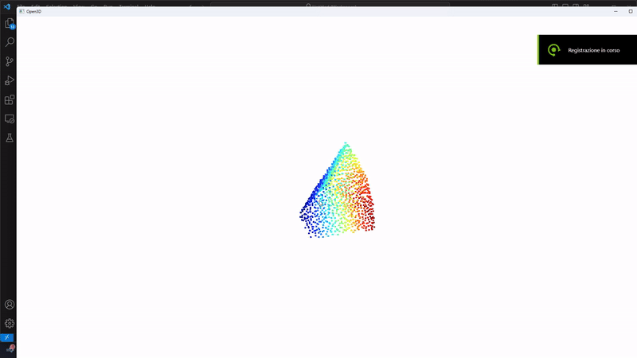

 # Pair Fragments

This repository refers to my master's thesis in the Data Science graduate program at Sapienza University.

The code used as a reference and starting point of this work for Point Cloud Transformer (PCT) is : [here](https://github.com/qq456cvb/Point-Transformers) (Menghao implementation)

*Pair Model*

## Data:

*Fragment 1 of Couple 0*

* The overall data used in this work is the Rotated cuts dataset (RCD) that comes from the Broken3D archive: [here](https://deeplearninggate.roma1.infn.it/)
* The Train set used is : [here](https://drive.google.com/file/d/1k0u6Ycnizsu2SJv-FDkrXtIK6mOiOoca/view?usp=drive_link)
* The randomized Validation set used is: [here](https://drive.google.com/file/d/1UWc90jlblj_aks512WgtJRRJe9qyxEEO/view?usp=drive_link)
* The randomized Test set used is: [here](https://drive.google.com/file/d/17YF-sJryzKPkg8W-1FRWMt_62Y3cS-1o/view?usp=drive_link)

## Files:
* `Main.ipynb` notebook that contains the model, in which all the 7 features (x, y, z, nx, ny, nz, A) are used;
* `Main_3_features.ipynb` notebook that contains the model, in which only the  first 3 features (x, y, z) are used;
* `Main_6_features.ipynb` notebook that contains the model, in which only the  first 6 features (x, y, z, nx, ny, nz) are used;
* `Main_Not_Augmentation.ipynb` notebook that contains the model in which all 7 features (x, y, z, nx, ny, nz, A) are used, but data augmentation is not applied;
* `Inferences_on_modified_fragments.ipynb` notebook that contains the attempt of inferences when the fragments are modified;
* `Visualize_fragments.ipynb` notebook that contains the code to graphically represent the fragments, both original and modified;
* `environment.yml` the conda envirorment to run the models
* `miniconda3.yaml` the conda environment to print fragments in notebook `Visualize_fragments.ipynb`
  
